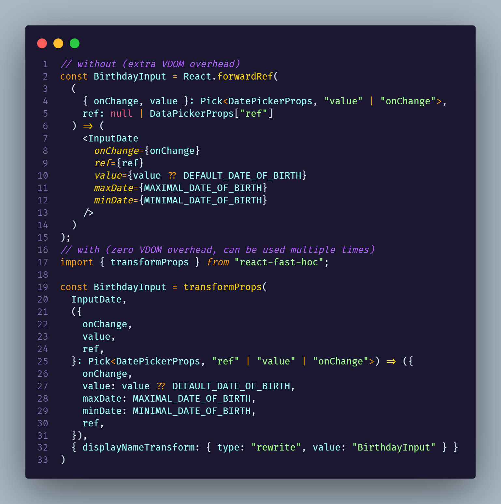

# React Fast HOC

Lightweight and type-safe High-Order Components (HOCs) library for React, leveraging high-order types from "hotscript" and JavaScript Proxies for zero VDOM overhead.

[](https://www.npmjs.com/package/react-fast-hoc)
[](https://bundlephobia.com/package/react-fast-hoc)
[](https://www.npmjs.com/package/react-fast-hoc)

<!-- [](https://bundlephobia.com/package/react-fast-hoc) -->



## Table of Contents

- [Installation](#installation)
- [Usage](#usage)
  - [transformProps](#transformProps)
  - [createHoc](#createHoc)
  - [createTransformProps](#createTransformProps)
- [API Reference](#api-reference)
- [Examples](#examples)
- [License](#license)

## Installation

Install the `react-fast-hoc` package:

pnpm:

```sh
pnpm i react-fast-hoc
```

npm:

```sh
npm i react-fast-hoc
```

yarn:

```sh
yarn add react-fast-hoc
```

Or with [ni](https://www.npmjs.com/package/@antfu/ni):

```sh
ni react-fast-hoc
```

Install the `hotscript` for creating complex props transformations:

```sh
ni -D hotscript
```

## Examples

```tsx
// without (extra VDOM overhead)
const BirthdayInput = React.forwardRef(
  (
    { onChange, value }: Pick<DatePickerProps, "value" | "onChange">,
    ref: null | DataPickerProps["ref"]
  ) => (
    <InputDate
      onChange={onChange}
      ref={ref}
      value={value ?? DEFAULT_DATE_OF_BIRTH}
      maxDate={MAXIMAL_DATE_OF_BIRTH}
      minDate={MINIMAL_DATE_OF_BIRTH}
    />
  )
);
// with (zero VDOM overhead, can be used multiple times)
import { transformProps } from "react-fast-hoc";

const BirthdayInput = transformProps(
  InputDate,
  ({
    onChange,
    value,
    ref,
  }: Pick<DatePickerProps, "ref" | "value" | "onChange">) => ({
    onChange,
    value: value ?? DEFAULT_DATE_OF_BIRTH,
    maxDate: MAXIMAL_DATE_OF_BIRTH,
    minDate: MINIMAL_DATE_OF_BIRTH,
    ref,
  }),
  { displayNameTransform: { type: "rewrite", value: "BirthdayInput" } }
);
```

## Usage

### transformProps

Directly create a new component with transformed props.

```ts
import { transformProps } from "react-fast-hoc";

const EnhancedComponent = transformProps(
  MyComponent,
  (props) => {
    // Transform props here
    return { ...props, transformedProp: "Transformed Value" };
  },
  { displayNameTransform: { type: "rewrite", value: "WithTransformedProps." } }
);
```

### createHoc

Create a new HOC with a custom props transformer and optional display name prefix.

```ts
import { createHoc } from "react-fast-hoc";

const withCustomLogic = createHoc({
  propsTransformer: (props) => {
    // Apply custom logic here
    return { ...props, customProp: "Custom Value" };
  },
  resultTransformer: null,
  displayNameTransform: {
    type: "prefix",
    value: "WithCustomLogic.",
  },
});

const EnhancedComponent = withCustomLogic(MyComponent);
```

### createTransformProps

Create a new HOC that transforms the props passed to the wrapped component.

```typescript
import { createTransformProps } from "react-fast-hoc";

const withTransformedProps = createTransformProps(
  (props) => {
    // Transform props here
    return { ...props, transformedProp: "Transformed Value" };
  },
  {
    displayNameTransform: {
      type: "prefix",
      value: "WithTransformedProps.",
    },
  }
);

const EnhancedComponent = withTransformedProps(MyComponent);
```

> You can use `wrapIntoProxy` to create more customizable hocs

## API Reference

Detailed API documentation can be found in the [API.md](./API.md) file.

## Examples

You can find example usage of `react-fast-hoc` in the [examples](./examples) folder.

## License

React Fast HOC is [MIT licensed](./LICENSE).
